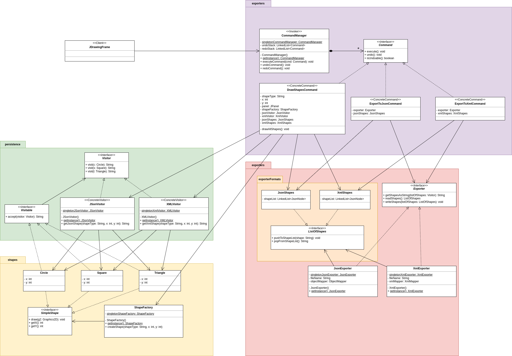
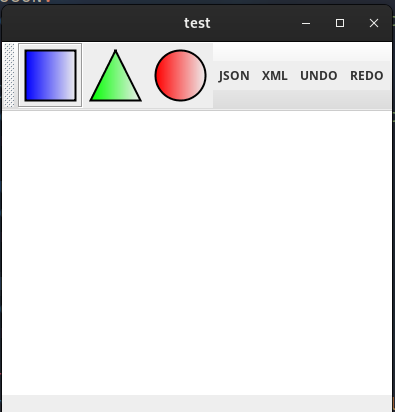

# Patrons Composants - Projet

> Par Timoty RAZAFINDRABE et Anas LAHROUCHI
> 

## Introduction

Dans le context d’un projet de l’UE Patrons et Composant, nous avons réalisé une application de dessin de formes. Ce projet a pour objectif principal de fournir un environnement (une fenêtre) pour dessiner, exporter, manipuler des formes géométriques et annuler ou restorer ces actions. Nous avons utilisé pour cela les patrons de conception : Visitor, Command, Factory et Singleton.

## Prérequis

### Installations:

Pour exécuter le projet Java 17 et Maven doivent être installés sur le système et configurés sur le PATH.

### Packages

Nous n’avons pas utilisé l’API javax pour l’exportation en JSON car nous l’avons trouver que le code était assez fastidieux à maintenir et à lire. De plus, javax ne fournissais pas de moyen pour exporter facilement en XML. Ainsi, nous avons à la place utilisé l’API Jackson qui permet non seulement d’écrire du code plus lisible et maintenable, mais rend aussi l’exportation JSON et XML plus facile.

Pour utiliser Jackson avec le projet, il suffit de

- Ajouter le `pom.xml` ci-dessous
- Exécuter `mvn clean install` dans le repertoire du projet

```xml
<project xmlns="http://maven.apache.org/POM/4.0.0"
	xmlns:xsi="http://www.w3.org/2001/XMLSchema-instance"
	xsi:schemaLocation="http://maven.apache.org/POM/4.0.0 http://maven.apache.org/xsd/maven-4.0.0.xsd">
	<modelVersion>4.0.0</modelVersion>
	<groupId>fr.uga.miage.m1</groupId>
	<artifactId>Persistence_g1_10</artifactId>
	<version>0.0.1-SNAPSHOT</version>
	<properties>
		<project.build.sourceEncoding>ISO-8859-1</project.build.sourceEncoding>
		<maven.compiler.source>17</maven.compiler.source>
    	<maven.compiler.target>17</maven.compiler.target>
    	<sonar.host.url>http://im2ag-sonar.u-ga.fr:9000</sonar.host.url>
	</properties>
	<dependencies>
		<!-- https://mvnrepository.com/artifact/org.glassfish/javax.json -->
		<dependency>
		    <groupId>org.glassfish</groupId>
		    <artifactId>javax.json</artifactId>
		    <version>1.1.4</version>
		</dependency>
		<dependency>
			<groupId>org.junit.jupiter</groupId>
			<artifactId>junit-jupiter-engine</artifactId>
			<version>5.4.0</version>
			<scope>test</scope>
		</dependency>
        <dependency>
            <groupId>com.fasterxml.jackson.core</groupId>
            <artifactId>jackson-databind</artifactId>
            <version>2.15.3</version>
        </dependency>
        <dependency>
            <groupId>com.fasterxml.jackson.dataformat</groupId>
            <artifactId>jackson-dataformat-xml</artifactId>
            <version>2.15.3</version>
        </dependency>
	</dependencies>
  	<build>
		<plugins>
			<plugin>
				<artifactId>maven-compiler-plugin</artifactId>
				<version>3.8.1</version>
			</plugin>
			<plugin>
            	<groupId>org.apache.maven.plugins</groupId>
            	<artifactId>maven-surefire-plugin</artifactId>
            	<version>3.0.0-M5</version>
        	</plugin>
            <plugin>
                <groupId>org.jacoco</groupId>
                <artifactId>jacoco-maven-plugin</artifactId>
                <version>0.8.7</version>
                <executions>
                    <execution>
                        <goals>
                            <goal>prepare-agent</goal>
                        </goals>
                    </execution>
                    <execution>
                        <id>generate-code-coverage-report</id>
                        <phase>test</phase>
                        <goals>
                            <goal>report</goal>
                        </goals>
                    </execution>
                </executions>
            </plugin>
       </plugins>
	</build>
</project>
```

## Structure

Le projet a la structure d’un projet Maven classique (`java` et `test` dans `src/main/`) avec les dossier `exports` et `conception` en plus

- Le dossier `exports` contient les fichier d’exportation JSON et XML
- Le dossier `conception` contient essentiellement le diagramme UML du code. Voir `UMLDiagram.png` :



Parmi les classes du projets, nous avons jugé que certaines seraient susceptibles d’être utilisées plusieurs fois sans que nous ayons besoin d’en créer plusieurs instances. De ce fait, les classes suivantes sont implémentées avec le pattern Singleton :

- `ShapeFactory`
- `JSonVisitor`, `XMLVisitor`
- `JsonExporter`, `XmlExporter`
- `CommandManager`

## Exécution

- Une fois les prérequis installés et configurés, il suffit d’exécuter le projet. Il est possible d’exécuter directement avec un IDE (ici, le projet a été testé avec VSCode).

Après lancement de l’application, la fenêtre suivante s’affiche :



## Fonctionnalité 1 : Dessiner des formes

Pour dessiner des formes, il faut cliquer sur une des formes géométrique sur la barre des tâches pour la sélectionner et ensuite cliquer sur le panel blanc pour placer la forme sur la position du curseur.

Cette fonctionnalité fait appel aux patrons Visitor, Command, Factory, et plus particulièrement la classe `DrawShapesCommand`. En effet, la classe `JDrawingFrame` qui joue le rôle du “client” fait appel à `CommandManager` qui elle exécute la `DrawShapesCommand`  :

Elle consiste à créer des shapes avec la classe `ShapeFactory` et les packages `shapes` et `percistence` lorsqu’un clique pour dessiner une forme est fait dessus. Ensuite, elle ajoute ces `shapes` dans les listes des classe `JsonShapes` et `XmlShapes`(ces listes sont en structure de pile ce qui servira dans la Fonctionnalité 3), et redessine toutes les `shapes` sur panel.

## Fonctionnalité 2 : Exporter en JSON ou XML

Pour exporter en JSON ou XML, il suffit de cliquer sur les boutons JSON et XML sur la barre des tâches. Les fichiers exportés peuvent être retrouvés dans `exports/`.

Cette fonctionnalité s’appuie énormément sur l’API Jackson :

Les classes `JsonShapes` et `XmlShapes` servent de modèles pour les mappers de Jackson. Ces mappers sont principalement utilisés dans les `Exporters` pour lire et écrire les fichiers JSON et XML.

Ces `Exporters` sont appelés par les commandes `ExportToJsonCommand` et `ExportToXmlCommand` qui sont elles-même exécutées par `CommandManager` qui elle est appelée par le client `JDrawingFrame`.

## Fonctionnalité 3 : Undo et Redo

Pour annuler une action/commande, il faut cliquer sur le bouton UNDO sur la barre des tâches et pour la rétablir, il faut cliquer sur REDO (au moins un UNDO doit être effectué avant un REDO).

Chaque commande a une fonction `undo()` qui permet d’annuler ses effets. Dans la classe `CommandManager`, les listes `undoStack` et `redoStack` servent d’historiques des actions respectivement effectuées (donc annulables) et annulées (donc rétablissables).

Lorsqu’une action est exécutée, `CommandeManager` la pousse sur la pile `undoStack` comme dernière action exécutée et vide `redoStack`.

Lorsqu’une action est annulée, `CommandManager` retire cette dernière action exécutée de la pile `undoStack`, exécute sont `undo()` et la pousse sur `redoStack`.

S’il y a des actions qui ont été annulées, donc qui peuvent être rétablis, alors `CommandeManager` retire la dernière commande annulée de `redoStack` et l’exécute à nouveau.

> Il faut noter que certaines commandes ne sont pas annulables comme l’export (logiquement, exporter un fichier devrait être définitif). Donc, si vous souhaiter annuler un export un message d’erreur s’affichera dans la console.
> 

## Conclusion et rétrospective

Pendant le développement de ce projet, nous avons constaté qu’il nous fallait trouver un compromis entre suivre les consignes, obtenir un code propre et le faire marcher pour répondre aux besoins. Par exemple, changer l’API d’export de fichier JSON et XML en une API plus adaptée nous a permis d’obtenir un code relativement propre et qui nous aura servi pour une autre fonctionnalité.

Nous avons également pris le temps d’expérimenter la méthode de développement orienté par les tests (appris en cours d’agilité) ce qui nous a fait gagner du temps dans l’écriture de tests unitaires.
